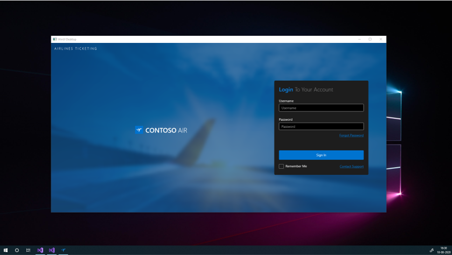
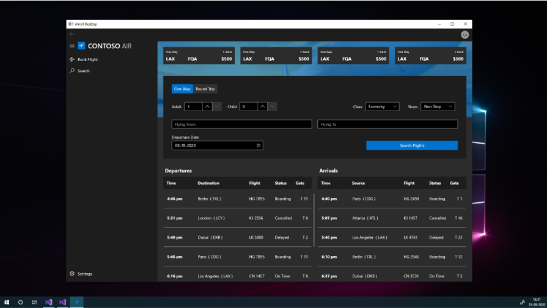
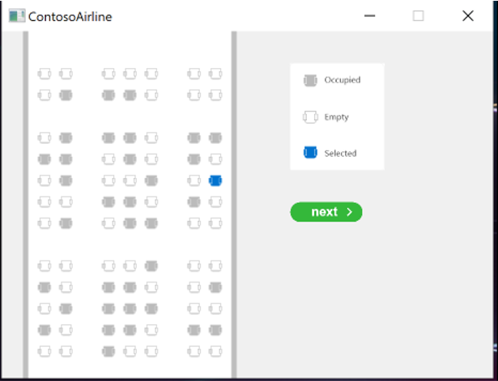

# Contoso Air WinUI 3 sample



The Contoso Air sample is a Point of Sale (POS) application that supports flight booking, seat selection and boarding pass generation.

The application shows how you can provide a modern look and feel, along with native UI performance, across multiple form factors and input types (touch, stylus and mouse / keyboard inputs) using the power and functionality of WinUI.

This sample includes two [WinUI 3 Preview 3](https://microsoft.github.io/microsoft-ui-xaml/) desktop applications, each built using one of the following WinUI Visual Studio templates:

- Native C++/Win32 desktop apps
- Managed desktop C#/.NET Core

See [Get started with WinUI 3 for desktop apps](https://docs.microsoft.com/windows/apps/winui/winui3/get-started-winui3-for-desktop) for more information on these WinUI 3 Visual Studio templates.

## Functionality



The following table lists the features supported by each version of the application.

|     Feature          |     C#/.NET Core    |    C++/Win32    |
| -------------------- | --------- | --------- |
| User Login           | Supported | Supported |
| Flight Search        | Supported | Supported |
| Passenger Form       | Supported | Supported |
| Seat Selection       |           | Supported |
| Boarding Pass Window | Supported | Supported |
| Change Theme         | Supported | Supported |
| Search Booking       | Supported |           |

## System requirements

- Windows 10

## Build the sample

1. If you download the samples ZIP, be sure to unzip the entire archive, not just the folder with the sample you want to build.
2. Start Microsoft Visual Studio and select File > Open > Project/Solution.
3. Starting in the folder where you unzipped the samples, go to the Samples subfolder, then the subfolder for this specific sample, then the subfolder for your preferred language ([C++](./ContosoAirlinePOSCpp) or [C#](./ContosoAirlinePOSCs)). Double-click the Visual Studio Solution (.sln) file.
4. Press Ctrl+Shift+B, or select Build > Build Solution.
5. Run the sample
6. The next steps depend on whether you just want to deploy the sample or you want to both deploy and run it.

### Deploying the sample

Select Build > Deploy Solution.

### Deploying and running the sample

To debug the sample and then run it, press F5 or select Debug > Start Debugging. 

To run the sample without debugging, press Ctrl+F5 or selectDebug > Start Without Debugging.

## How to Use

For descriptions of the various pages and features within the application, see the [Sample walkthrough](./docs/contoso-airlines-pos-feature-list.pdf).

### Seat selection utility



The C++/Win32 solution includes a *SeatSelectionBooking* project, which generates a traditional C++ library for rendering the seat selection UI using [SDL (Simple DirectMedia Layer)](https://www.libsdl.org/).

> [!NOTE]
> Due to security restrictions, the DLL generated by this project can only be used by the Native C++/Win32 desktop app through the Win32 reflection API.

## Architecture

Both the native C++/Win32 and the managed C#/.NET Core samples use MVVM.

### C++

See [C++/WinRT Data Binding](https://docs.microsoft.com/en-us/windows/uwp/cpp-and-winrt-apis/binding-collection) to learn more about data binding in C++/WinRT.

### C#

This sample uses a `TinyIoC` container to support dependency injection.

```C#
// ContosoAirlinePOSCs/IoC/DIHelper.cs

_container = new TinyIoCContainer();

// View models - by default, TinyIoC will register concrete classes as multi-instance.
_container.Register<LoginViewModel>();
_container.Register<ShellViewModel>();
_container.Register<BookFlightViewModel>();
_container.Register<SearchResultViewModel>();
_container.Register<SearchViewModel>();
_container.Register<SettingsViewModel>();

// Services - by default, TinyIoC will register interface registrations as singletons.
_container.Register<INavigationService, NavigationService>();
_container.Register<IRepository, MockRepository>();
_container.Register<IFlightSearchService, FlightSearchService>();
_container.Register<IFlightBookingService, FlightBookingService>();
```

All the Model classes inherit from a `ModelBase` class, which inherits from the `INotifyPropertyChanged` interface (to support data binding).

```C#
public class ModelBase : INotifyPropertyChanged
{
    public event PropertyChangedEventHandler PropertyChanged;
    protected void OnPropertyChanged([CallerMemberName] string propertyName = null) => PropertyChanged?.Invoke(this, new PropertyChangedEventArgs(propertyName));
}
```

Similarly, all ViewModel classes inherit from a `ViewModelBase` class that inherits from the `INotifyPropertyChanged` interface to support data binding.

## License

MIT License

Copyright (c) Microsoft Corporation. All rights reserved.

Permission is hereby granted, free of charge, to any person obtaining a copy of this software and associated documentation files (the "Software"), to deal in the Software without restriction, including without limitation the rights to use, copy, modify, merge, publish, distribute, sublicense, and/or sell copies of the Software, and to permit persons to whom the software is furnished to do so, subject to the following conditions:

The above copyright notice and this permission notice shall be included in all copies or substantial portions of the Software.

THE SOFTWARE IS PROVIDED "AS IS", WITHOUT WARRANTY OF ANY KIND, EXPRESS OR IMPLIED, INCLUDING BUT NOT LIMITED TO THE WARRANTIES OF MERCHANTABILITY, FITNESS FOR A PARTICULAR PURPOSE AND NONINFRINGEMENT. IN NO EVENT SHALL THE AUTHORS OR COPYRIGHT HOLDERS BE LIABLE FOR ANY CLAIM, DAMAGES OR OTHER LIABILITY, WHETHER IN AN ACTION OF CONTRACT, TORT OR OTHERWISE, ARISING FROM, OUT OF OR IN CONNECTION WITH THE SOFTWARE OR THE USE OR OTHER DEALINGS IN THE SOFTWARE.
